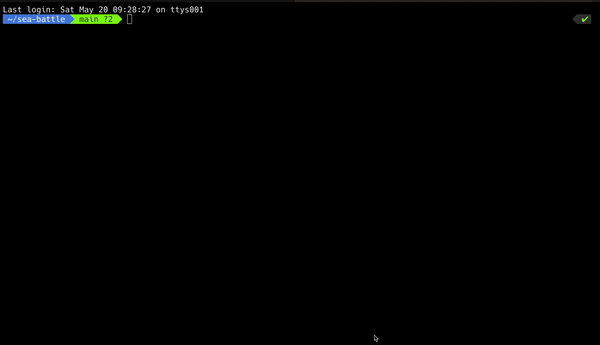

# Sea battle

# Content
1. [Introduction](#introduction)
    1. [📜 Rules](#-rules)
2. [🧑‍🔬 Further Improvements](#-further-improvements)
3. [📦 Component (package) Description](#component-package-description)
    1. [Ship, damage, empty cells and other constants](#ship-damage-empty-cells-and-other-constants)
    2. [🗺️ PlayerMap](#%EF%B8%8Fplayermap)
    3. [🚢 Ships](#ships)
    4. [📍 Coordinates](#-coordinates)
    5. [Map And Ship](#map-and-ship)
    6. [Players Initializer](#players-initializer)
    7. [🎮 Game](#-game)

# Introduction

This for the terminals.

## 📜 Rules

[https://www.cs.nmsu.edu/~bdu/TA/487/brules.htm](https://www.cs.nmsu.edu/~bdu/TA/487/brules.htm)

# 🧑‍🔬 Further improvements

- [ ]  Invalidations
- [ ]  Refactoring of some packages
- [ ]  Bot improvements

# 📦 Component (package) Description

## Ship, damage, empty cells and other constants

String representation of these variables on the ********map********.

| SHIP | “S” |
| --- | --- |
| HIT | “X” |
| EMPTY | “ “ |
| MISS | “M” |
| YES | “y” |
| NO | "n” |
| FirstPlayer | 1 |
| SecondPlayer | 2 |
| MAP_COLUMNS | " 1 | 2 | 3 | 4 | 5 | 6 | 7 | 8 | 9 | 10” |
| COLUMN_BOTTOM_DIVIDER | "===========================================” |
| BOTTOM_DIVIDER | "-------------------------------------------” |
| YOUR_BOARD_NAME | "                          YOU                            “ |
| OPPONENT_BOARD_NAME | "                        OPPONENT                  “ |

## 🗺️ PlayerMap

The main map of the game. The whole map will be assembled (in the game) by 2 maps. 1 map for 1 player.

| Type | Struct |
| --- | --- |

| Value members | Description | Type |
| --- | --- | --- |
| TheMap | It contains the key to the row and number as column. | map[string][]string |
| Width | The width of the battle map. It is 10 by default game. | const int |
| Height | A height is the same as width. | const int |
| fillPureMap(TheMap) | Fills TheMap (with ” ” (space)).  |  |
| ShadowMap | Map for the opponent to hide the ships from each other. | map[string][]string |

| Functions | Description | Return type |
| --- | --- | --- |
| Constructor | Creates a map according to the width and height. By default all the values inside of the map is “ ” (space). |  |
| String [interface] | It will show the current state of the map. It is going to show the all variables inside the PlayerMap for now. | string |
| GetDamage(string, int) | Accepts string and int coordinates as the parameter and damages with “X” if the current coordinate has “S”, if not puts “M”. |  |
| GetCell(string, int) | Accepts string and int coordinates as the parameter and returns the value of that cell. | string |
| PlaceUnit(string, int) | Accepts string and int coordinates as the parameter and places the value “S” to the PlayerMap. |  |
| GetLetterCoordinates() | Depends on the Width constant, default values are from “A” - “J”. | [Width]string |
| MapPrinter(PlayerMap) | Returns the map in string format. | string |
| isDefeated | Check’s the player’s map, if non “S” occurs it returns “True”, otherwise “False” | bool |
| emptyRow | 10 empty strings. (” “) | [Width]string |

## 🚢 Ships

[Battleship (game)](https://en.wikipedia.org/wiki/Battleship_(game))

The ship types

| Ship class | Occupied cells | Quantity (in game) |
| --- | --- | --- |
| Carrier | 5 | 1 |
| Battleship | 4 | 1 |
| Destroyer | 3 | 1 |
| Submarine | 3 | 2 |
| Patrol Boat | 2 | 2 |

| Type | Struct |
| --- | --- |

| Value members | Description | Type |
| --- | --- | --- |
| class | The class of the ship. | string (ShipClass) |
| CellsToOccupy | Cells that can be occupied by the ship. | int (ShipOccupy) |

| Functions | Description | Return type |
| --- | --- | --- |
| Constructor (string) | Creates a Ship according to the parameters class. |  |
| String [interface] | Returns the Ship description info. | string |

## 📍 Coordinates

| Type | Struct |
| --- | --- |

| Value members | Description | Type |
| --- | --- | --- |
| StartRow | Beginning position of the row. | string |
| StartColumn | Beginning position of the column. | int |
| EndRow | End position of the row. | string |
| EndColumn | End position of the column | int |

| Functions | Description | Return type |
| --- | --- | --- |
| Constructor (string) | Creates a new coordinate according to the initial params. Splits string by regex: (\\w{1}(10|\\d{1}))(:| |-)(\\w{1}(10|\\d{1})) | Coordinates |
| String [interface] | Returns formatted coordinates. | string |
| randomStartEndRow (shipOccupy) | Creates a random row coordinates so that the length between same as the ship’s cell occupation. | (string, string) |
| randomStartEndColumn (shipOccupy) | Creates a random column coordinates so that the length between same as the ship’s cell occupation | (int, int) |
| randomColumn | Generates a random number between [1-10] | int |
| randomRow | Generates a random number and takes the value of the row according to the generated random number. [0-9] | string, int (value of the row, index of the value) |
| randomAxis | Generates a random float and when the value is > 0.5 it will return Vertical, otherwise Horizontal. | Axis |
| randomHorizontalCoordinates (Ship)  | Generates a random coordinates that happens to be Horizontal (the rows are the same). | Coordinates |
| randomVerticalCoordinates (Ship)  | Generates a random coordinates that happens to be Vertical (the rows are the same). | Coordinates |
| RandomCoordinatesFor (Ship) | Generates a coordinates for the ship according to the specification of it (cells that occupies the ship) | Coordinates |
| StringToCoordinates (string) | Takes an input and formats the input to the valid coordinates. | (Coordinates, error) |
| StringToRowColumn (string) | Takes an half coordinate and return the letter and the digit. | (string, int) |
| RandomHalfCoordinates | Returns a letter and digit. | (string, int) |

## Map And Ship

| Type | Struct |
| --- | --- |

| Value members | Description | Type |
| --- | --- | --- |
| ships | All the ships with Ship objects and the quantity of the ships that should be places on the map. | []ShipQuantity |
| playerMap | Player’s map. | PlayerMap |

| Inner Structs | Description |
| --- | --- |
| ShipQuantity | Holds information about the ship object and the quantity of it that will be places on the map. |

| Functions | Description | Return type |
| --- | --- | --- |
| Constructor | Creates a MapAndShip object. | MapAndShip |
| String [interface] | Returns the information about map and the ships description info. | string |
| newShipByClass (ShipClass) | Returns a ship object according to the class of it. | Ship |
| newShipAndQuantity (ShipClass, quantity) | Returns an object of the ship by class and quantity that will be placed on the map. | ShipQuantity |
| newCoordinate | Returns an object of the coordinate by given string. | Coordinates |
| placeShip (Coordinates) | As a parameter get the Coordinates struct type, and then places the ship according to the struct’s values. |  |
| forPlacer (Coordinates, int, Axis) | Helper function for placeShip. Helps to traverse according to the axis. |  |
| isOverlapping (Coordinates) | Function that checks is the current coordinate free to place the ship. | bool |
| uniquePlacement | Places all the ships from Map And Ship to the playerMap. Each coordinate is unique and does not overlap with others. |  |
| ShadowString | Returns the information about map the clone of the map. | string |
| verticalKeysAndIndexes (Coordinates) | Shortens the way for the vertical placement. | ([]string, int, int) |

## Players Initializer

| Type | Struct |
| --- | --- |

| Value members | Description | Type |
| --- | --- | --- |
| FirstPlayer | The first player of the game. Always the person who runs the game. | MapAndShip |
| SecondPlayer | Bot or the second player. (The second player mode has not implemented yet). | MapAndShip |

| Functions | Description | Return type |
| --- | --- | --- |
| Constructor | Creates a Players object. | Players |
| String [interface] | Returns the information about map and the players ships. | string |
| IsOnOfThePlayersDefeated | Check’s both players by IsDefeated method. | bool |
| EntireMap | Returns the actual map of the first player and shadow map of the second player. | string |

## 🎮 Game

| Functions | Description | Return type |
| --- | --- | --- |
| Constructor | Creates a Game object. |  |
| initializePlayers | Initialises and returns players. | Players |
| announceAGame | Announces how to access the game rules and greetings to the user. |  |
| startGame | Inner function that handles the main gameplay. |  |
| yourBoard(PlayerMap) | Gets the firstPlayer and print’s his randomly generated map with placed ships. |  |
| readyToGo | Asks to start a game. |  |
| goodbye | Last print before leaving the game. |  |
| promptToStartAGame | Prompts user to start a game, if the users replies are something different from “y” or “no” it will ask again. In the “no” case game stops. The “y” proceeds to the next step. | bool |
| opponentsShadowMap (PlayerMap) | Shows the opponents shadow map. |  |
| yourBoardHasAttacked (PlayerMap) | Shows your map after opponents attack. |  |
| howToAttackCoordinates | Information about how to prompt correct coordinates to do damage. |  |
| clearConsole | Clear the console. |  |
| makeMove (playerMap, playerMap) | Gets prompt from player and sets the damage to the opponent. |  |
| botMakeMove(playerMap, playerMap) | Same as makeMove, but for the bot. |  |
| isGameEnded(Players) | Checks if the game has ended yet. | bool |

# 📂 Repository

https://github.com/StarLightNova/sea-battle
